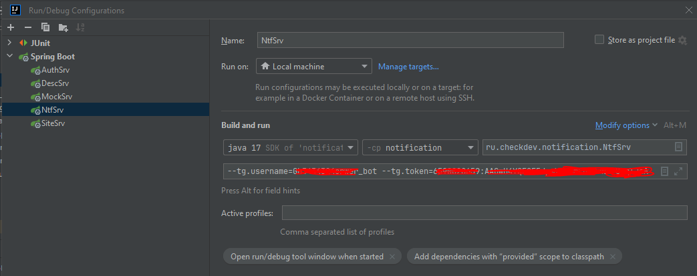

## **[CheckDev](https://checkdev.ru/index)** — пробные собеседования в IT

Фроект является форком.
Добавлена следующая функциональность:
1. Меню телеграмм бота:
- /start
- /new - зарегистрировать пользователя по email
- /bind - привязать данный телеграм аккаунт к проекту Checkdev 
- /unbind - отвязать данный телеграм аккаунт от проекта Checkdev
- /check - показать email и Имя пользователя, привязанного к данному телеграм аккаунту

2. Интеграция notification с Kafka для получения Notify
3. Настройка Dockerfile для сервисов, docker-compose.yml. С сохранением функциональности в тч телеграм бот

#### Telegram bot (notification service)

В сервисе Notification активно используется telegram бот.
Для разработки вам понадобится зарегистрировать свой бот, это можно сделать через
@BotFather (https://t.me/BotFather) в telegram.
Не имеет значение как вы назовете свой бот, вы будете его использовать только для локальной разработки.
После успешной регистрации у вас будет название бота и его токен.
Чтобы каждый раз не вносить правки в проект в properties файл и отслеживать что вы работаете
со своим ботом, можно прописать информацию о нем в IntelliJ IDEA,
в конфигурации запуска сервиса Notification.

Заходим в меню "Run" - "Edit Configurations..."
В поле "Program arguments" вписываем имя бота и токен в формате

```
--tg.username=***********bot --tg.token=*******:******************
```

подставляя соответственно свои значения полученные при регистрации бота.
Сохраните выполненные настройки.



#### Swagger.

Для получения развернутой информации о REST API сервисов вы можете воспользоваться Swagger,
соответственно перед этим запустив локальные сервисы

- Auth сервис - http://localhost:9900/swagger-ui/index.html
- Desc сервис - http://localhost:9902/swagger-ui/index.html
- Mock сервис - http://localhost:9912/swagger-ui/index.html
- Notification сервис - http://localhost:9920/swagger-ui/index.html

___