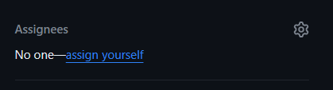
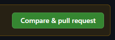
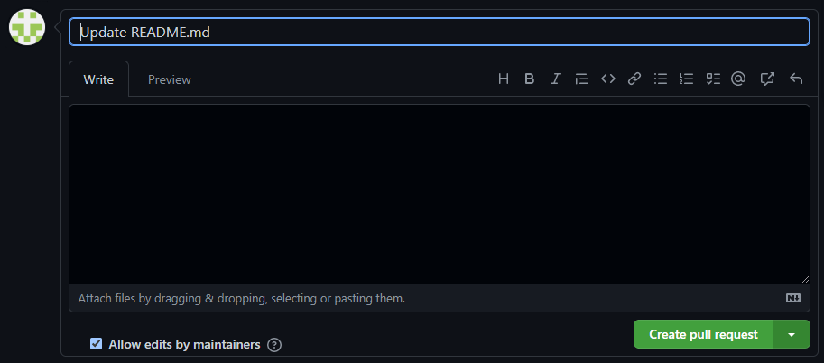

## **[CheckDev](https://checkdev.ru/index)** — пробные собеседования в IT

___

### Добро пожаловать в команду. Обязательно ознакомьтесь с правилами работы на проекте.

___

### Работа в проекте.

Работа происходит через fork (копия главного репозитория позволяющая
вносить изменения в проект независимо от оригинального репозитория)
чтобы создать fork главного репозитория проекта, нажмите на кнопку "fork"


на странице главного репозитория. Затем откроется окно создания fork`а,
заполните поля и нажмите "Create fork". Далее скачайте проект в свой
локальный репозиторий.

#### Обновление проекта.

Создайте специальную ветку для загрузки в неё изменений из главного
репозитория, для этого откройте вкладку "Git" в нижнем левом углу
IntelliJ IDEA, в левой стороне открывшейся вкладки, правой кнопкой
мыши нажмите на пункт "Remote" (раздел с ветками удалённых репозиториев)
и выберите "Manage Remotes", откроется окно "Git Remotes". В открывшемся
окне нажмите "плюс", откроется форма с полями, первое — название ветки,
второе — ssh ссылка на главный репозиторий, заполните и нажмите "Ok".


Теперь при команде git pull, или сочетании команд git fetch и git merge,
изменения из главного репозитория должны скачиваться в эту ветку и слияние
текущего состояния Вашего локального проекта должно происходить с ней. При
возникновении конфликтов слияния их нужно разрешить в специальном окне.
После слияния нужно сделать коммит в Ваш fork-репозиторий.

#### Задачи для выполнения.

В главном репозитории есть раздел Issues


он содержит задачи для выполнения. Члены команды разработчиков выбирают
задачи самостоятельно, для этого нужно выбрать свободную задачу, её поле
"Assignees" будет пустым



и нажать "assign yourself" в этом поле — таким образом выполнение задачи
перейдёт под Вашу ответственность. Выбирать уже занятые задачи и более
одной задачи одновременно нельзя.

#### Выполнение задач.

Перед выполнением задачи следует обновить проект описанным выше образом.

Каждая задача выполняется в отдельной ветке, каждая ветка создаётся от
Вашей основной (main) ветки.

Для контроля изменений в SQL базах данных проекта используется Liquibase.
Поэтому все (DDL, DML) операции с базами данных выполняйте только через написание
новых SQL скриптов. Не нужно править старые скрипты, под ВСЕ даже незначительные
изменения - создавайте новые SQL скрипты.

Поле того как вы выполнили задачу еще раз проверьте что ваша ветка использует последние
актуальные обновления проекта.

Перед отправкой коммита выполненной задачи убедитесь, что все unit-тесты проходят,
проект собирается, Ваш код работает, нет замечаний по Checkstyle`у, зайдите на сервис
как пользователь - убедитесь что добавленный функционал работает со стороны пользователя,
еще раз перепроверьте что в вашем коммите учтены все последние обновления проекта.

#### Тестирование.

Unit-тесты:

- Если задача подразумевает написание какой-то логики, нужно написать на эту логику unit-тесты.
- В проекте используется Jacoco, он автоматически проверяет уровень покрытия тестами.
  При недостаточном покрытии - проект не соберется.
- Обязательно убедитесь что все unit-тесты ВСЕХ сервисов проекта проходят,
  проект собирается, нет замечаний по Checkstyle`у.

Smoke-тесты:

- Это ручное тестирование со стороны пользователя основного функционала сервисов.

Сценарии smoke тестирования:

1. Анонимный пользователь.

- Заходим на главную страницу сайта
- Переходим в раздел "Новые запросы на проведение собеседований" пробуем откликнуться
- Переходим в раздел "Собеседования" пробуем откликнуться
- Переходим в раздел "Популярные категории" пробуем создать собеседование
- Переходим в раздел "Категории" пробуем создать собеседование
- Переходим в раздел "Профили", заходим в 1-2 профиля

Анонимный пользователь имеет права на чтение, но на запрос каких либо действий
должна выполняться переадресация его на страницу авторизации.
В процессе выполнения вышеперечисленных действий убедитесь что сайт не падает с ошибками.

2. Собеседование.

- Зайдите на страницу авторизации. Зарегистрируйте два пользователя через telegram.
- Зайдите на сайт под первым пользователем, перейдите в раздел "Категории" и создайте новое собеседование.
- Зайдите на сайт под вторым пользователем, выберите собеседование которое создал 1й участник и подайте заявку на
  участие.
- От имени 1го пользователя согласуйте участие в собеседовании 2го.
- От имени 1го пользователя оставьте отзыв, от имени 2го оставьте отзыв.
- По мере прохождения сценария теста обратите внимание как меняется статус собеседования и какие уведомления получают
  пользователи.

Авторизованный пользователь имеет существенно больше прав чем анонимный,
он может создавать и принимать участие в собеседованиях, получать уведомления.
Полезным будет посмотреть какие данные добавляются в SQL таблицы по мере выполнения вами сценария тестирования.

Обязательно проводите как автоматизированное (unit), так и ручное (smoke)
тестирование перед отправкой каждого коммита, это сильно сэкономить время вам
и упростит работу вашей команде.
Выше приведены примеры возможных сценариев smoke-тестирования, они могут изменяться и дополняться по мере развития
проекта.

#### Pool Request (далее PR).

После отправки коммита с выполненной задачей на удалённый репозиторий,
(Ваш fork основного репозитория) на его странице отобразится оповещение с
кнопкой о том, что пора создать PR, нажмите на эту кнопку.



Откроется форма создания PR, заполните, в пункте "Development" права внизу
выберите задачу к которой относится Ваш PR и нажмите "Create pull request"
внизу формы.




Дождитесь обработки PR. Если возникают конфликты слияния, их нужно разрешить,
либо на странице Github (в случае если конфликты несущественны), либо, что
происходит чаще нужно откатить коммит к предыдущему, обновить проект в ветке
с текущей задачей, разрешить конфликты в специальном окне IntelliJ IDEA и
сделать новый коммит в режиме force, в той же ветке. При этом новый PR
создавать не надо, Ваш коммит обработается как предыдущий. Действия того же
характера выполняются при других ошибках и непрохождении валидации PR.
После успешного прохождения валидации, в issue нужно добавить комментарий
с информацией о затраченном на задачу времени, например: "Ушло три часа".

Принимать, отклонять PR и закрывать задачи может только руководитель проекта.

После принятия PR руководителем проекта, можете удалить посвящённую ему ветку
из локального и удалённого репозитория.

#### Разрешение конфликтов слияния.

В форме ли разрешения конфликтов слияния на странице Github, или в специальном
окне IntelliJ IDEA, смысл этого процесса сводится к добавлению нужных строк
кода из главного репозитория и вашей текущей ветки с задачей, а так же удалению,
или замене ненужных строк и файлов. В результате должен получиться готовый
рабочий результат без конфликтов. В форме разрешения конфликтов слияния на
странице Github предоставляется текстовый редактор, где в конфликтном файле
необходимо стереть ненужные участки кода и утвердить нужные стерев все
вспомогательные пометки редактора и после принять изменения кнопкой в правом
верхнем углу. В форме разрешения конфликтов IntelliJ IDEA окно поделено на три
части: левая — ваши изменения, правая — изменения из главного репозитория,
центральная — результирующий файл.

При разрешении конфликтов слияния нужно проявлять особую внимательность.

#### Telegram bot (notification service)

В сервисе Notification активно используется telegram бот.
Для разработки вам понадобится зарегистрировать свой бот, это можно сделать через
@BotFather (https://t.me/BotFather) в telegram.
Не имеет значение как вы назовете свой бот, вы будете его использовать только для локальной разработки.
После успешной регистрации у вас будет название бота и его токен.
Чтобы каждый раз не вносить правки в проект в properties файл и отслеживать что вы работаете
со своим ботом, можно прописать информацию о нем в IntelliJ IDEA,
в конфигурации запуска сервиса Notification.

Заходим в меню "Run" - "Edit Configurations..."
В поле "Program arguments" вписываем имя бота и токен в формате

```
--tg.username=***********bot --tg.token=*******:******************
```

подставляя соответственно свои значения полученные при регистрации бота.
Сохраните выполненные настройки.


#### Swagger.

Для получения развернутой информации о REST API сервисов вы можете воспользоваться Swagger,
соответственно перед этим запустив локальные сервисы

- Auth сервис - http://localhost:9900/swagger-ui/index.html
- Desc сервис - http://localhost:9902/swagger-ui/index.html
- Mock сервис - http://localhost:9912/swagger-ui/index.html
- Notification сервис - http://localhost:9920/swagger-ui/index.html

___